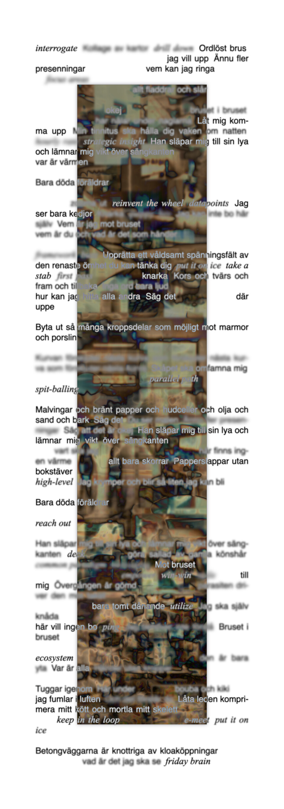

# Lös Monolit

**Live at [palmdrop.github.io/los-monolit](https://palmdrop.github.io/los-monolit)**

"Lös Monolith" (Loose monolith) is a visual poetry project based on two poems, written by me (found in `src/content/poems`), and two are.na channels ([`stupid-office-words`](https://www.are.na/didier-l/stupid-office-words) and [`vibin in the office aedificium`](https://are.na/palmdrop/vibin-in-the-office-aedificium)).

# License

License is specified in `LICENSE.md`. Please note that the code and poem contents are covered by different licenses.

# Tools

- [SolidStart](https://start.solidjs.com/)

# Example

